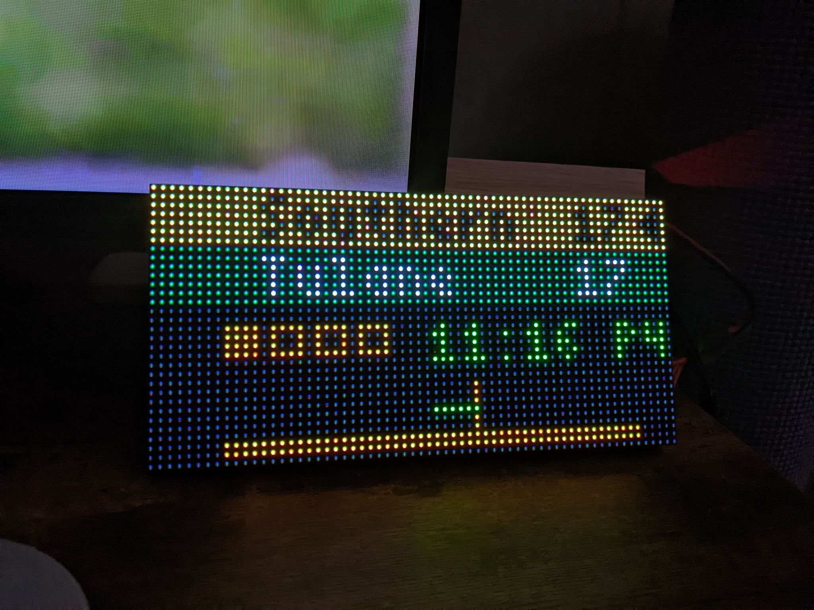
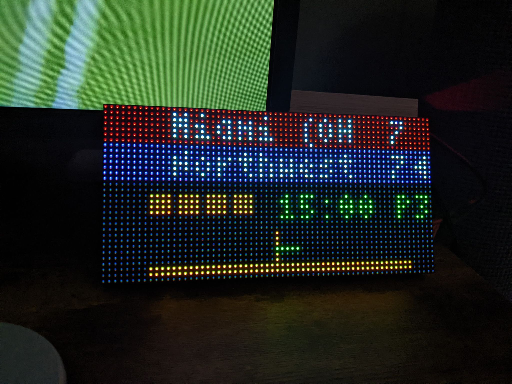

# cfb-led-scoreboard




LED scoreboard for college football.

## Setup

Follow the `Hardware Assembly` and `Software Installation` setup instructions for the [MLB LED scoreboard](https://github.com/MLB-LED-Scoreboard/mlb-led-scoreboard), 

and for the `Installing the scoreboard software` section, do the steps below instead:

```
git clone https://github.com/mitchshiotani/cfb-led-scoreboard.git
cd cfb-led-scoreboard/
sudo ./install.sh
```

## Usage

Currently only the 32 x 64 boards are supported.

```
sudo python main.py --led-gpio-mapping="adafruit-hat" --led-cols 64
```
